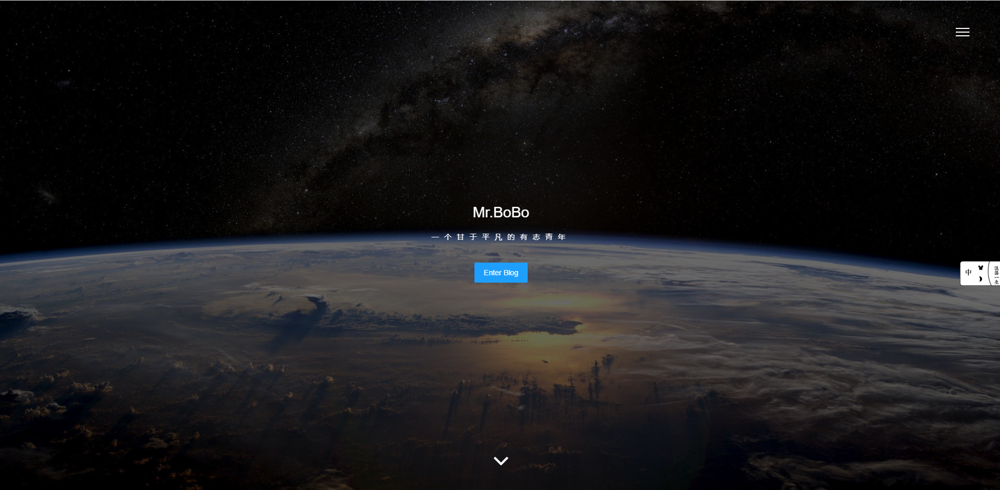
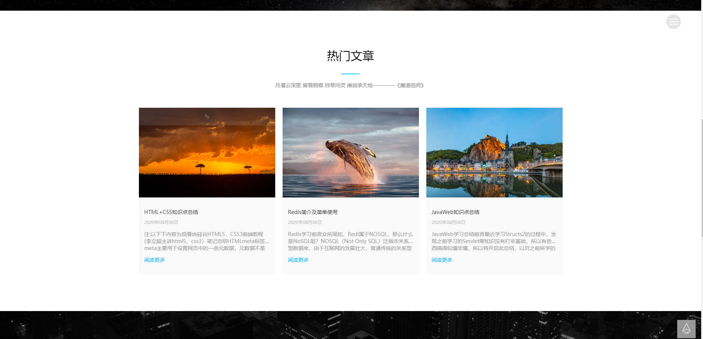
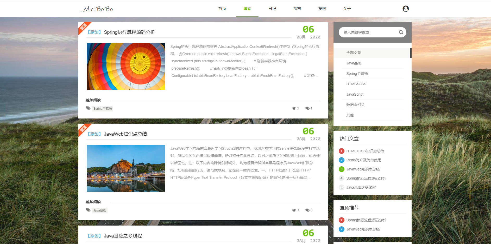

# 关于

本项目是我自己正在使用的一款博客项目，因为是新手，所以写的有点乱，以后会逐渐完善，使其成为一个大的博客项目，中间肯定会有错误，欢迎各位指正！

### 前端

前端界面来自：https://www.yanshisan.cn/ ，并对其进行了一些修改优化。前端主要采用layui框架，十分优美雅观。

### 后端

后端采用SSM框架+shiro+lucene+redis编写。

### 预览网址

www.xinglili.top/blog

